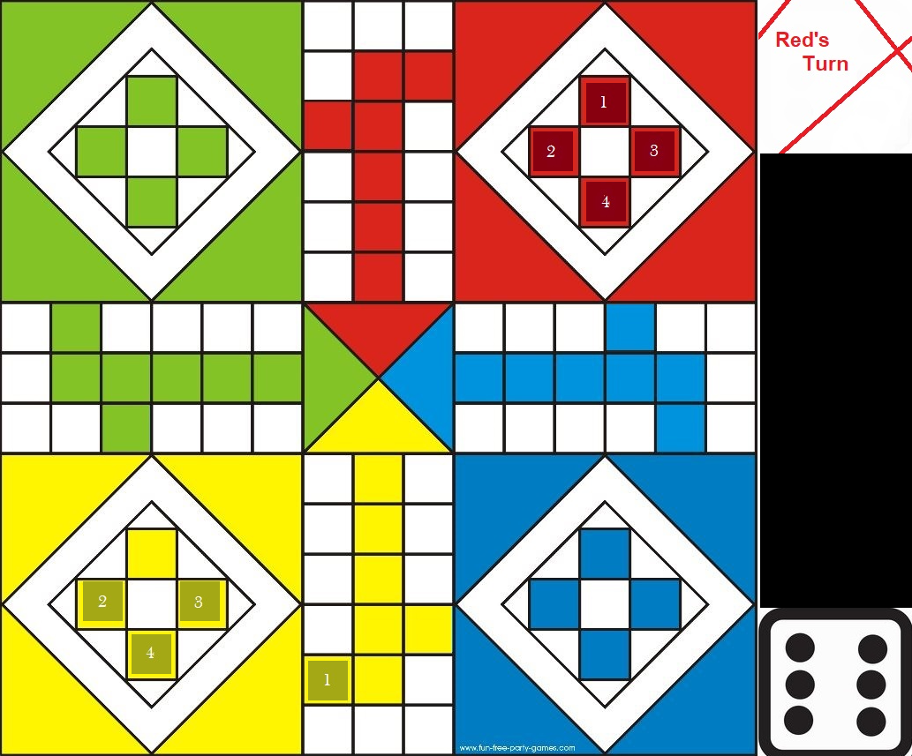

# sfml_Ludo_Project
Ludo Game designed using SFML Visualization tool with C++ algorithm implementation. Player can also save their record on system.

## Pre-Requisities
Visual Studio - IDE
SFML - Visualization Tool
Assets

### **Setup**
* Clone the repository on your directory.
* Open the project in the Visual Studio IDE.
* Setup SFML Visualization tool using its provided documentation on their website. 
> https://www.sfml-dev.org/tutorials/2.5/start-vc.php
* Execute the application.
* Inputs for the game are Spacebar, and Choosing Pawn.

### **Screenshots**

